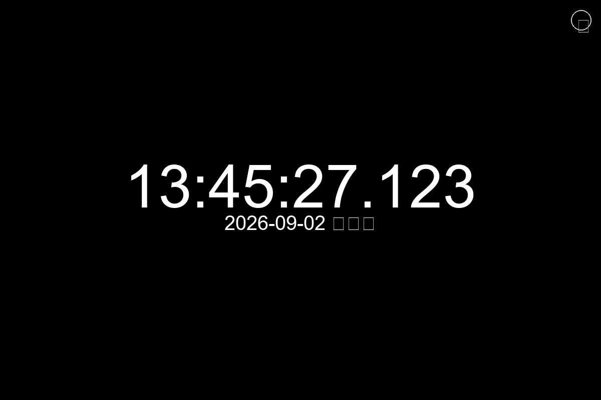
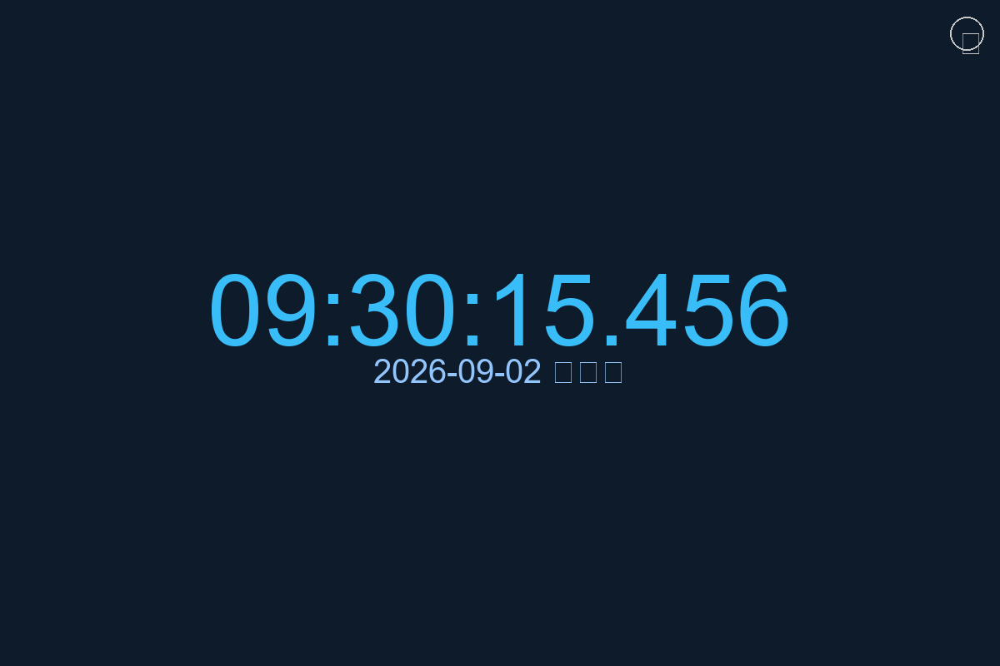
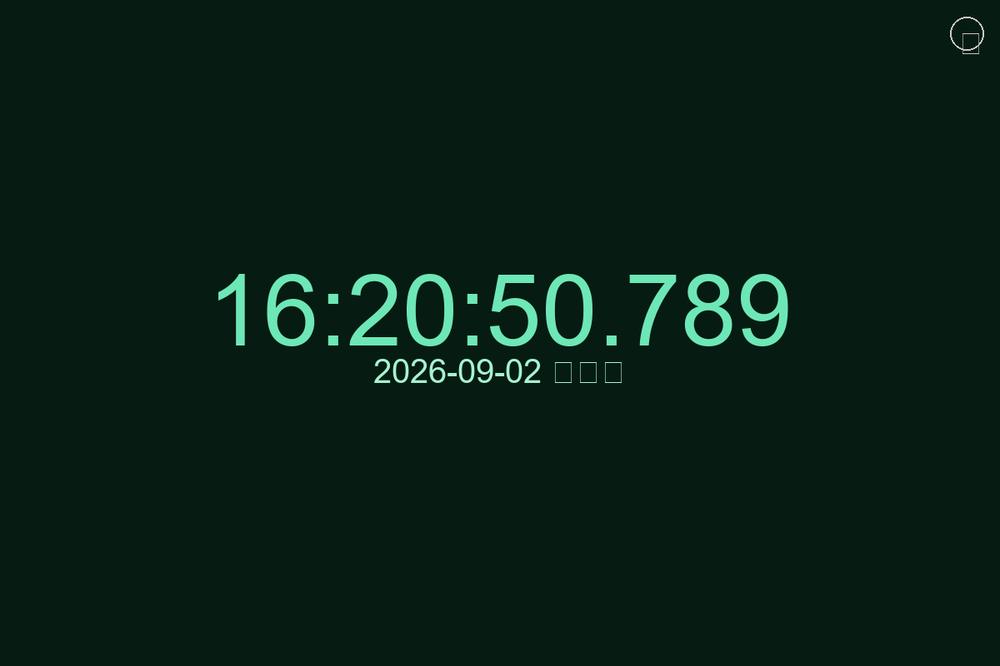
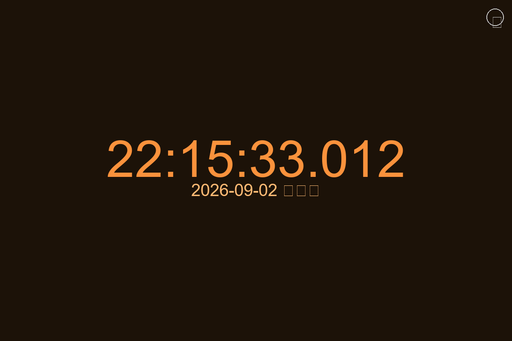
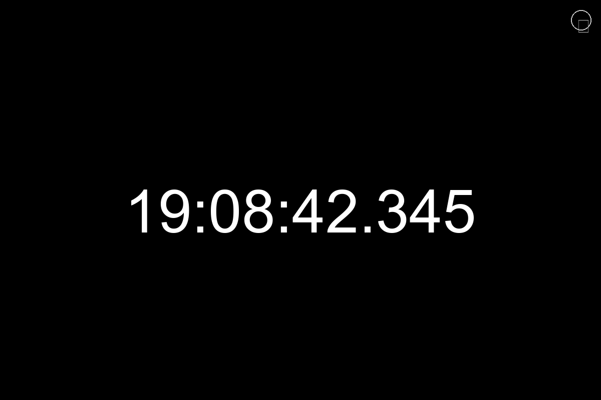

# Fullscreen Clock - 全屏时钟

一个功能强大的 Flutter 跨平台全屏时钟应用。

## 应用截图

### 主界面


### 多种主题
<table>
  <tr>
    <td></td>
    <td></td>
  </tr>
  <tr>
    <td></td>
    <td></td>
  </tr>
</table>

## 功能特性

- ⏰ **精确时间显示** - HH:mm:ss.SSS 格式（小时:分钟:秒.毫秒）
- 📅 **日期显示** - 可选显示/隐藏，支持中文星期
- 🎨 **自定义颜色** - 背景、时间、日期颜色独立设置
- 📏 **字体大小调节** - 时间和日期字体大小独立控制
- 🖥️ **全屏模式** - 双击屏幕、F11 键或设置中切换
- 💾 **配置保存** - 所有设置自动保存到本地
- 🌐 **跨平台支持** - Windows、macOS、Linux、Android、iOS、Web

## 快捷键

- **F11** - 切换全屏模式
- **双击屏幕** - 切换全屏模式
- **右侧滚动** - 调整时间/日期字体大小

## 快速开始

### 开发运行

**Windows:**
```powershell
.\run_dev.bat
```

**macOS/Linux:**
```bash
chmod +x run_dev.sh
./run_dev.sh
```

### 多平台构建（推荐）

使用交互式菜单构建多个平台：

**Windows:**
```powershell
.\build_multi.bat
```

**macOS/Linux:**
```bash
chmod +x build_multi.sh
./build_multi.sh
```

菜单选项：
- [1] 当前平台（Windows/macOS/Linux）
- [2] Android APK
- [3] Android App Bundle
- [4] iOS（仅 macOS）
- [5] Web
- [6] 全部构建

## 构建说明

### 单平台快速构建

**Windows:**
```powershell
.\build_release.bat
```

**macOS/Linux:**
```bash
chmod +x build_release.sh
./build_release.sh
```

### 手动构建

#### Windows
```powershell
flutter clean
flutter pub get
dart run flutter_launcher_icons
flutter build windows --release
```
构建输出: `build\windows\x64\runner\Release\`

#### macOS
```bash
flutter clean
flutter pub get
dart run flutter_launcher_icons
flutter build macos --release
```
构建输出: `build/macos/Build/Products/Release/fullscreen_clock.app`

#### Linux
```bash
flutter clean
flutter pub get
dart run flutter_launcher_icons
flutter build linux --release
```
构建输出: `build/linux/x64/release/bundle/`

#### Android APK
```bash
flutter build apk --release
```
构建输出: `build/app/outputs/flutter-apk/app-release.apk`

#### Android App Bundle
```bash
flutter build appbundle --release
```
构建输出: `build/app/outputs/bundle/release/app-release.aab`

#### iOS
```bash
flutter build ios --release --no-codesign
```
构建输出: `build/ios/iphoneos/Runner.app`
注意：需要在 Xcode 中打开进行签名和发布

#### Web
```bash
flutter build web --release
```
构建输出: `build/web/`

## 开发运行

手动运行：
```bash
# 安装依赖
flutter pub get

# 运行开发版本（自动选择设备）
flutter run

# 指定平台运行
flutter run -d windows
flutter run -d macos
flutter run -d linux
flutter run -d chrome
flutter run -d android
```

## 项目脚本

项目包含以下便捷脚本：

| 脚本 | Windows | macOS/Linux | 说明 |
|------|---------|-------------|------|
| 开发运行 | `run_dev.bat` | `run_dev.sh` | 快速启动开发模式 |
| 单平台构建 | `build_release.bat` | `build_release.sh` | 构建当前平台 Release 版本 |
| 多平台构建 | `build_multi.bat` | `build_multi.sh` | 交互式菜单选择构建目标 |
| 图标生成 | `generate_icon.py` | `generate_icon.py` | Python 脚本生成应用图标 |

## 依赖项

- `flutter` - Flutter SDK
- `shared_preferences` - 本地配置存储
- `intl` - 国际化和日期格式化
- `window_manager` - 桌面窗口管理（Windows/macOS/Linux）
- `flutter_colorpicker` - 颜色选择器
- `flutter_launcher_icons` - 应用图标生成（dev）

## 项目结构

```
fullscreen_clock/
├── lib/
│   ├── main.dart              # 应用入口
│   ├── clock_screen.dart      # 主时钟显示页面
│   ├── settings_screen.dart   # 设置页面
│   └── config.dart            # 配置管理类
├── assets/
│   └── icon.png              # 应用图标 (512x512)
├── build_release.bat         # Windows 单平台构建脚本
├── build_release.sh          # macOS/Linux 单平台构建脚本
├── build_multi.bat           # Windows 多平台构建脚本
├── build_multi.sh            # macOS/Linux 多平台构建脚本
├── run_dev.bat               # Windows 开发运行脚本
├── run_dev.sh                # macOS/Linux 开发运行脚本
├── generate_icon.py          # 应用图标生成脚本
├── pubspec.yaml              # Flutter 依赖配置
└── README.md                 # 项目文档
```

## 配置说明

所有配置自动保存到本地，包括：
- 背景颜色（默认：黑色）
- 时间颜色（默认：白色）
- 日期颜色（默认：白色）
- 时间字体大小（默认：100）
- 日期字体大小（默认：40）
- 是否显示日期（默认：显示）
- 全屏状态

## 许可证

MIT License

---

**提示**: 首次构建前请确保已安装 Flutter SDK 并配置好开发环境。
